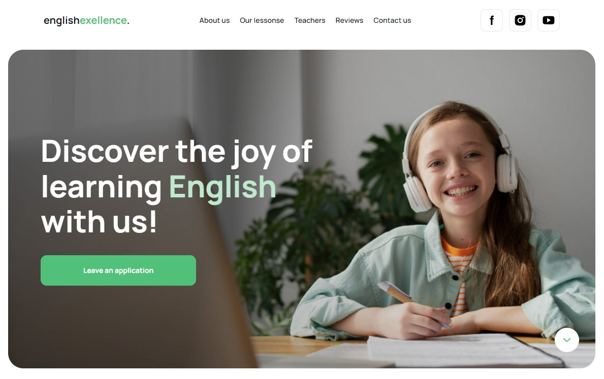

# Командний проєкт

Метою роботи команди було створення landing page application про 
курси з англійської мови

## Моя участь у роботі команди

Мені було доручено та мною реалізована верстка секції Reviews, а також 
підключення та логіка робити свайперу.
Для цього використав бібіліотеку swiper.

## Команда

Хочу висловити щиру подяку кожному хто приймав участь у проєкті. 
Це був корисний та важливий досвід спільної роботи.

## Frontend:

## Backend:

---

### Thank you for watching!